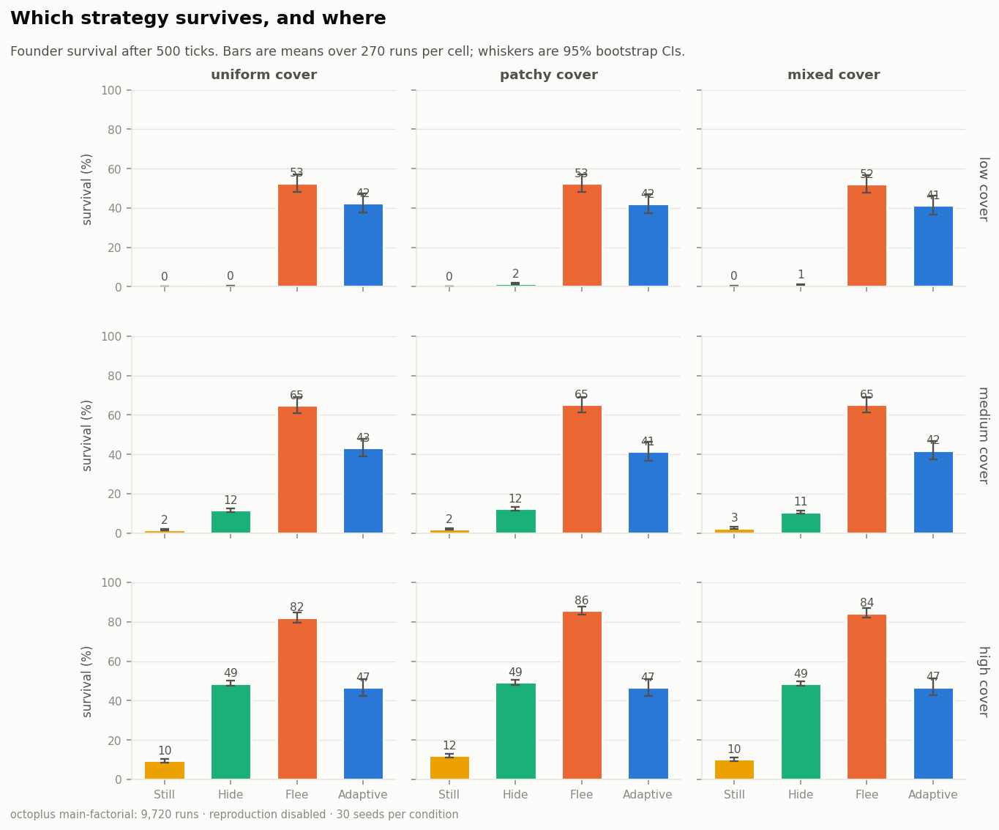
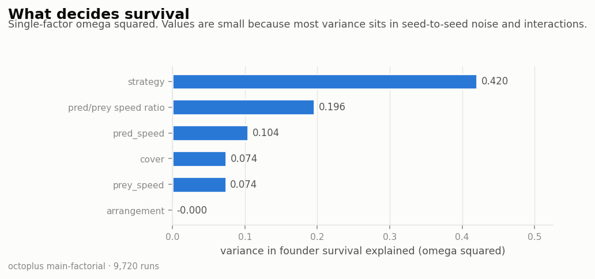
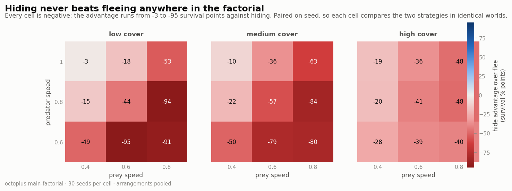
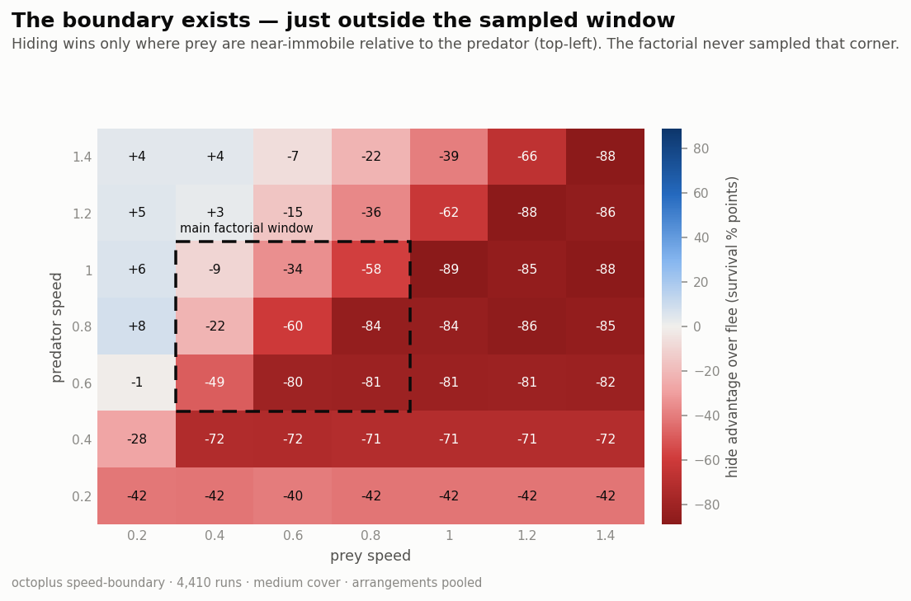
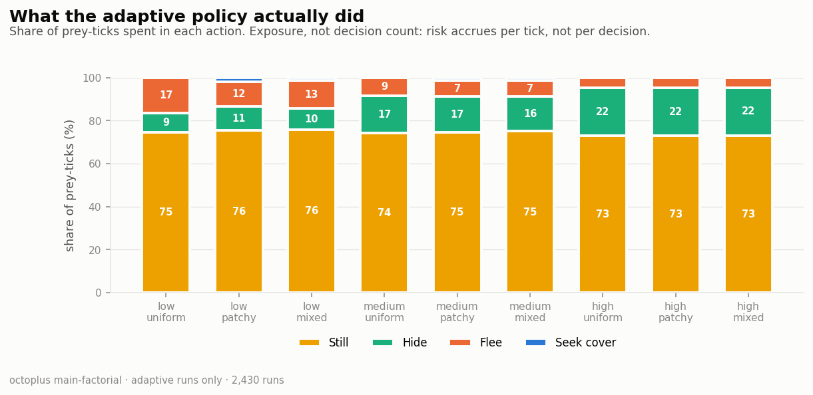
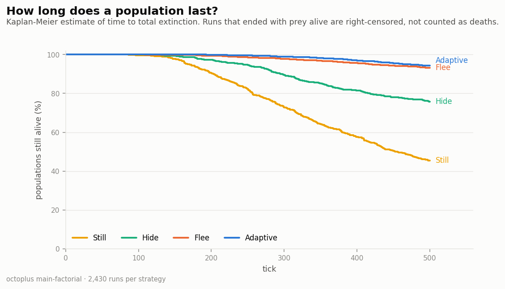

# Hide or Flee? Adaptive Predator–Prey Multi-Agent Simulation

A NetLogo multi-agent simulation investigating when prey should:

- remain still;
- hide using environmental cover;
- flee from a predator; or
- move toward better cover before hiding.

The model is inspired by cephalopod camouflage, but it is an abstract computational model rather than a biologically complete simulation of octopus behavior.

## Research question

> Under which environmental and predator–prey conditions is it better for an autonomous prey agent to stay still, hide, flee, or seek nearby cover?

The visual animation helps explain the model, but the main contribution is the controlled experimental comparison of prey strategies across quantified environmental conditions.

---

## Contents

1. [Project overview](#project-overview)
2. [Research objectives](#research-objectives)
3. [Model entities](#model-entities)
4. [Environment](#environment)
5. [Prey strategies](#prey-strategies)
6. [Adaptive decision model](#adaptive-decision-model)
7. [Predator behavior](#predator-behavior)
8. [Detection model](#detection-model)
9. [Reaction delay](#reaction-delay)
10. [Capture rule](#capture-rule)
11. [Reproduction](#reproduction)
12. [Model parameters](#model-parameters)
13. [Metrics](#metrics)
14. [Running the model](#running-the-model)
15. [Interface controls](#interface-controls)
16. [Self test](#self-test)
17. [Experimental design](#experimental-design)
18. [BehaviorSpace configuration](#behaviorspace-configuration)
19. [Results](#results)
20. [Analysis pipeline](#analysis-pipeline)
21. [Hypotheses](#hypotheses)
22. [Important experimental cautions](#important-experimental-cautions)
23. [Assumptions and limitations](#assumptions-and-limitations)
24. [Implemented functionality](#implemented-functionality)
25. [Future work](#future-work)
26. [Suggested report structure](#suggested-report-structure)
27. [Project summary](#project-summary)

---

# Project overview

The model contains autonomous prey agents and predator agents in a spatial environment.

Each patch has a continuous environmental cover value. Prey can use this cover to reduce their probability of being detected. Predators search the world, detect visible prey, and pursue the nearest detected target.

The model supports fixed prey policies and an adaptive policy.

The fixed policies provide experimental baselines:

- always stay still;
- always hide;
- always flee.

The adaptive policy uses local information to decide whether to:

- stay still;
- hide immediately;
- flee;
- or seek better cover.

The purpose is not to prove that one strategy is universally superior. The purpose is to identify the conditions under which the relative advantage of each strategy changes.

---

# Research objectives

The model is intended to answer questions such as:

1. Does hiding outperform fleeing when environmental cover is abundant?
2. How much usable cover must exist before hiding becomes effective?
3. Does the spatial arrangement of cover matter independently of total cover?
4. Is patchy cover better or worse than uniformly distributed cover?
5. When does seeking cover become too dangerous?
6. How does predator speed affect the hide-versus-flee boundary?
7. How does prey speed affect the same boundary?
8. Does movement-related visibility make fleeing ineffective in some conditions?
9. Does the adaptive strategy outperform fixed strategies?
10. Does the adaptive strategy make decisions appropriate to its environment?
11. How much longer do prey survive even when all prey are eventually captured?
12. Are results robust across repeated random seeds?

These questions must be answered using repeated experiments and numerical results, not by observing one visually interesting run.

---

# Model entities

## Prey: octopuses

Each octopus has:

- a fixed policy;
- a currently active strategy;
- a previous counted strategy;
- an individual movement speed;
- a reaction timer;
- a reacting state;
- a hidden state;
- a moving state;
- local access to environmental cover;
- local awareness of nearby predators.

Prey decisions are decentralized. There is no central controller choosing actions for the whole population.

Each adaptive prey independently observes its local situation and selects an action.

## Predators

Each predator has:

- a base detection radius;
- movement speed;
- a current target;
- a search state;
- a pursuit state.

Predators search by wandering through the environment. When one or more prey are detected, a predator selects the nearest visible prey and moves toward it.

## Patches

Each patch has:

```text
cover-density
```

`cover-density` is a continuous value in the range:

```text
0.0 to 1.0
```

Interpretation:

| Cover value | Interpretation |
|---:|---|
| `0.0` | No environmental cover |
| `0.25` | Weak cover |
| `0.50` | Moderate cover |
| `0.75` | Strong cover |
| `1.0` | Maximum modeled cover |

Cover is an abstract combination of environmental properties that could help conceal an animal, such as:

- rocks;
- reef structures;
- vegetation;
- shadows;
- visual texture;
- background matching opportunities.

It is not intended to represent a specific physical measurement.

---

# Environment

Two independent settings define an environment:

1. **cover amount**;
2. **cover arrangement**.

Separating these properties is important.

If a patchy environment always contains more total cover than a uniform environment, it is impossible to know whether differences in survival were caused by:

- the amount of cover; or
- its spatial arrangement.

The improved model therefore treats them as separate experimental variables.

## Cover amount categories

The `cover-amount-category` setting determines the target mean cover.

| Category | Target mean cover |
|---|---:|
| `"low"` | `0.15` |
| `"medium"` | `0.45` |
| `"high"` | `0.75` |

The realized value is available through:

```netlogo
average-world-cover
```

and:

```netlogo
realized-cover-mean
```

Small differences can arise from numeric operations, but the environment generation procedure normalizes cover toward the selected target.

## Cover arrangements

The `cover-arrangement` setting supports:

| Arrangement | Description |
|---|---|
| `"uniform"` | Cover is distributed relatively evenly across patches |
| `"patchy"` | Cover is concentrated into spatial clusters |
| `"mixed"` | Background cover is combined with stronger clusters |

### Uniform

Uniform environments contain only small local variations around the target mean.

A medium-uniform environment should therefore have approximately the same total cover as a medium-patchy environment, but its cover is distributed more evenly.

### Patchy

Patchy environments begin with very low background cover. Cover is then added around randomly selected cluster centers.

Cover strength decreases with distance from the center of each cluster.

This creates:

- high-cover hiding locations;
- low-cover open spaces;
- travel costs between cover patches;
- differences in accessibility.

### Mixed

Mixed environments combine:

- moderate background cover;
- stronger local clusters.

They represent an intermediate condition between uniform and strongly patchy environments.

## Environment normalization

After the initial pattern is generated, patch values are adjusted toward the selected target mean.

When the current mean is below the target, patches are proportionally moved toward `1`.

When the current mean is above the target, values are proportionally scaled toward `0`.

This preserves the broad spatial pattern while allowing arrangements with approximately comparable mean cover.

All final values are constrained to:

```text
0 <= cover-density <= 1
```

---

# Prey strategies

## Still

A still prey:

- does not move;
- does not receive the movement detection penalty;
- is not treated as actively camouflaged;
- remains vulnerable according to local environmental cover.

This is a useful baseline because it separates the effect of avoiding movement from the additional effect of hiding.

Model state:

```text
is-moving? = false
is-hidden? = false
```

## Hide

A hiding prey:

- remains stationary;
- attempts to use local environmental cover;
- receives a cover-dependent camouflage benefit;
- does not receive the movement detection penalty.

Model state:

```text
is-moving? = false
is-hidden? = true
```

Hiding does not automatically work in open water. Its effectiveness increases continuously with local cover.

## Flee

A fleeing prey:

- turns away from the nearest predator;
- moves at its prey speed;
- does not receive the hiding benefit;
- receives the movement detection modifier.

Model state:

```text
is-moving? = true
is-hidden? = false
```

Fleeing can increase distance from the predator, but movement can also make prey easier to detect.

## Seek cover

A prey seeking cover:

- identifies the strongest nearby cover patch;
- checks whether the patch offers a meaningful cover improvement;
- estimates whether it can reach that patch before the predator;
- moves toward it when the target appears useful and reachable;
- hides after reaching sufficiently strong cover.

Seeking cover is best interpreted as a **transitional action**, not necessarily as a primary fixed-strategy baseline.

It combines two risks:

1. movement temporarily increases detectability;
2. the prey may not reach cover before the predator arrives.

## Fixed and adaptive policies

The model supports the following values for `octopus-strategy-mode`:

| Value | Meaning |
|---|---|
| `"still"` | All prey remain still |
| `"hide"` | All prey attempt to hide |
| `"flee"` | All prey flee when their action is executed |
| `"seek-cover"` | All prey attempt to move toward better cover |
| `"adaptive-dmas"` | Each prey selects an action from local information |
| `"experimental-assigned"` | Each prey is randomly assigned a fixed strategy |

The main experimental comparison should use:

- `"still"`;
- `"hide"`;
- `"flee"`;
- `"adaptive-dmas"`.

The `"experimental-assigned"` mode is useful for demonstrations of heterogeneous populations, but it is not as easy to interpret as separate controlled baseline runs.

---

# Adaptive decision model

The adaptive policy uses only local information available to each prey.

It does not know:

- the global strategy distribution;
- future predator movements;
- future capture outcomes;
- which strategy will produce the best experimental result.

The policy follows these general steps:

1. Find the nearest predator.
2. Stay still if there is no predator within the awareness radius.
3. Flee if the predator is critically close.
4. Evaluate the value of hiding locally.
5. Evaluate the value of fleeing.
6. Evaluate whether stronger nearby cover is useful and reachable.
7. Seek cover if its projected hiding value exceeds the immediate alternatives.
8. Otherwise choose the greater of the hide and flee scores.
9. Stay still if both scores are negligible.

## Threat awareness

A predator is considered relevant when:

```text
distance to predator <= threat-awareness-radius
```

If no predator is in this range, an adaptive prey selects `"still"`.

## Emergency flee rule

If:

```text
distance to predator <= critical-threat-distance
```

the adaptive prey immediately selects `"flee"`.

This emergency rule is evaluated before the normal score comparison.

## Threat urgency

Threat urgency is:

```text
urgency =
    1 - predator distance / threat awareness radius
```

The result is constrained to the range `0` to `1`.

Interpretation:

| Urgency | Meaning |
|---:|---|
| `0` | Predator is at or beyond the awareness boundary |
| `0.5` | Predator is halfway through the awareness range |
| `1` | Predator is at the prey’s location |

## Hide score

The hide score is based on:

- candidate cover;
- modeled camouflage strength;
- threat urgency.

Conceptually:

```text
hide score =
    cover
    × camouflage strength
    × reaction safety
```

Camouflage strength is:

```text
1 - hide-detection-multiplier
```

Reaction safety is:

```text
1 - 0.35 × threat urgency
```

The score is constrained to the range `0` to `1`.

Hiding becomes more attractive when:

- cover is strong;
- the configured hiding multiplier represents effective camouflage;
- the predator has not already reached critical distance.

The emergency flee rule separately handles extremely close threats.

## Flee score

The flee score is based on:

- threat urgency;
- prey speed relative to predator speed.

Conceptually:

```text
flee score =
    threat urgency
    × relative prey speed
```

Relative speed is:

```text
prey speed / predator speed
```

and is constrained to the range `0` to `1` for scoring.

Fleeing becomes more attractive when:

- the threat is closer;
- prey speed is competitive with predator speed.

## Minimum decision score

If both hide and flee scores are below:

```text
minimum-decision-score
```

the adaptive prey stays still.

This prevents very weak score differences from forcing unnecessary movement or hiding actions.

## Cover target selection

The prey searches patches within:

```text
seek-cover-radius
```

It selects the patch with the greatest `cover-density`.

The target is useful only if:

```text
target cover >= minimum-cover-target
```

and:

```text
target cover >= local cover + minimum-cover-improvement
```

This prevents prey from moving toward a patch that is only trivially better than its current location.

## Cover reachability estimate

The model estimates travel time as:

```text
distance to target cover / prey speed
```

Estimated predator arrival time is:

```text
distance to predator / predator speed
```

The target is considered reachable when:

```text
travel time < estimated predator arrival time
```

This is deliberately a simple local estimate. It is not a complete prediction of future movement, obstacles, or predator strategy.

---

# Predator behavior

Predators have two main states.

## Search

When no prey is detected, a predator:

- has no target;
- randomly changes heading;
- moves at a fraction of its normal speed.

Search movement is:

```text
predator speed × predator-search-speed-factor
```

The random turning range is controlled by:

```text
predator-wander-angle
```

## Pursuit

When prey are visible, a predator:

1. selects the nearest visible prey;
2. faces that prey;
3. moves toward it;
4. captures it if the capture-distance condition is satisfied.

If the previously selected target is no longer visible, the predator can select another visible prey or return to searching.

---

# Detection model

Detection is represented through an effective predator detection radius.

The general equation is:

```text
effective detection radius =
    base predator detection radius
    × environmental cover modifier
    × hiding modifier
    × movement modifier
```

A prey is detected when:

```text
distance to predator <= effective detection radius
```

## Environmental cover modifier

The environmental cover modifier is:

```text
1 - local cover × cover-impact-strength
```

It is constrained to remain nonnegative.

As local cover increases, detection radius decreases.

For example, with:

```text
cover-impact-strength = 0.8
```

the environmental modifier is approximately:

| Local cover | Cover modifier |
|---:|---:|
| `0.00` | `1.00` |
| `0.25` | `0.80` |
| `0.50` | `0.60` |
| `0.75` | `0.40` |
| `1.00` | `0.20` |

## Hiding modifier

If the prey is not hiding:

```text
hiding modifier = 1
```

If the prey is hiding:

```text
hiding modifier =
    1 - local cover × (1 - hide-detection-multiplier)
```

This corrects an important problem in the original prototype.

Hiding now provides no additional benefit when cover is zero. Its maximum benefit is only reached when cover is `1`.

With:

```text
hide-detection-multiplier = 0.15
```

the approximate modifiers are:

| Local cover | Hiding modifier |
|---:|---:|
| `0.00` | `1.0000` |
| `0.25` | `0.7875` |
| `0.50` | `0.5750` |
| `0.75` | `0.3625` |
| `1.00` | `0.1500` |

This means hiding in an open environment is not automatically effective.

## Movement modifier

If the prey is not moving:

```text
movement modifier = 1
```

If the prey is moving:

```text
movement modifier = motion-detection-multiplier
```

The default is:

```text
motion-detection-multiplier = 1.5
```

Movement therefore increases the effective detection radius by 50% under the default configuration.

## Example calculation

Suppose:

```text
base detection radius = 10
local cover = 0.50
cover impact strength = 0.80
hide detection multiplier = 0.15
```

The environmental modifier is:

```text
1 - 0.50 × 0.80 = 0.60
```

For a hiding prey, the hiding modifier is:

```text
1 - 0.50 × (1 - 0.15) = 0.575
```

The effective radius is:

```text
10 × 0.60 × 0.575 × 1 = 3.45
```

For a moving prey with a movement multiplier of `1.5`, the effective radius is:

```text
10 × 0.60 × 1 × 1.5 = 9
```

This demonstrates the central trade-off:

- hiding can reduce detection;
- fleeing can increase distance;
- movement can also increase visibility.

---

# Reaction delay

Prey do not necessarily act immediately after detecting a relevant threat.

The delay is controlled by:

```text
prey-reaction-time-setting
```

While reacting, a prey:

- does not move;
- is not hidden;
- displays the `"WAIT"` state when labels are enabled.

When no threat is present, its reaction timer resets.

Reaction delay should be included in experiments because it can change whether hiding, fleeing, or seeking cover is viable.

---

# Capture rule

A predator captures its selected prey when:

```text
distance to target <= capture-distance
```

When capture occurs:

- the prey is removed from the model;
- `total-captures` increases;
- the current tick is added to `capture-ticks`;
- `first-capture-tick` is updated if this is the first capture;
- `last-capture-tick` is updated.

---

# Reproduction

Without recruitment the only possible long-run outcome is extinction, so strategy differences can only ever appear as *time-to-extinction*. Optional sexual reproduction closes the population loop: the system can reach a dynamic equilibrium between predation and births, and strategy differences become visible as sustained population levels.

Reproduction is controlled by `enable-reproduction?`. When it is `false`, the model behaves exactly like earlier baseline versions.

## Per-prey state

Each octopus tracks:

- `sex`, either `\"female\"` or `\"male\"`, assigned at birth with equal probability;
- `age`, incremented by one every tick the prey is alive;
- `repro-cooldown`, a per-female timer preventing back-to-back births.

Founders created at `setup` are initialised as adults (`age = maturity-age`) so the population is fertile from tick 0.\n\n## Mating rule\n\nEvery tick, after selecting and performing its action, each prey calls `try-reproduce`. A birth occurs when **all** of the following are true:\n\n- `enable-reproduction?` is `true`;\n- the prey is female;\n- `age >= maturity-age`;\n- `repro-cooldown = 0`;\n- world population is below `carrying-capacity`;\n- the prey is not currently reacting to a threat;\n- the prey's active strategy is not `\"flee\"`;\n- at least one mature male exists within `mating-radius`.\n\nThe biological interpretation is that prey do not attempt to breed while under active predation pressure and that a nearby mate is required.\n\n## Offspring\n\nOn a successful mating, the mother `hatch`es `offspring-per-birth` offspring. NetLogo's `hatch` copies the parent's turtle state, which means each offspring inherits the parent's fixed `policy` (`\"hide\"`, `\"flee\"`, `\"still\"`, `\"seek-cover\"`, or `\"adaptive-dmas\"`).\n\nThe offspring's transient state is then reset:\n\n- `age` is set to `0`;\n- `repro-cooldown` is set to `reproduction-cooldown-setting`, so newborns cannot immediately breed;\n- `sex` is re-randomised;\n- `is-hidden?`, `is-moving?`, `is-reacting?`, and `active-strategy` are cleared;\n- movement speed and reaction timer are set to the current global settings.\n\nThe mother's `repro-cooldown` is then reset to `reproduction-cooldown-setting` and `total-births` is incremented.\n\n## Selection pressure\n\nBecause offspring inherit `policy`, running with `octopus-strategy-mode = \"experimental-assigned\"` now produces genuine selection over the strategy mix: policies whose bearers reach maturity and reproduce become more common, while policies whose bearers are captured young decline. The strategy composition of the population is therefore an emergent outcome rather than a fixed input.\n\nThis does **not** replace controlled single-strategy baselines. It complements them: baselines quantify how each policy performs in isolation, while `\"experimental-assigned\"` with reproduction shows which policies survive when they must compete for a place in the next generation.\n\n---\n\n# Model parameters

## Population parameters

| Parameter | Default | Description |
|---|---:|---|
| `initial-octopuses` | `40` | Number of prey created during setup |
| `initial-predators` | `3` | Number of predators created during setup |

## Movement and detection parameters

| Parameter | Default | Description |
|---|---:|---|
| `predator-detection-radius-setting` | `10` | Base predator detection radius in patch-distance units |
| `predator-speed-setting` | `0.8` | Predator movement distance per tick |
| `prey-speed-setting` | `0.6` | Prey movement distance per tick |
| `prey-reaction-time-setting` | `2` | Number of reaction-delay ticks |
| `capture-distance` | `0.5` | Distance at which a predator captures prey |

## Predator search parameters

| Parameter | Default | Description |
|---|---:|---|
| `predator-wander-angle` | `15` | Maximum random search turn in degrees |
| `predator-search-speed-factor` | `0.5` | Search speed as a fraction of normal predator speed |

## Adaptive decision parameters

| Parameter | Default | Description |
|---|---:|---|
| `threat-awareness-radius` | `10` | Distance within which a predator affects adaptive decisions |
| `hide-cover-threshold` | `0.55` | Cover required for a patch to count as usable hiding cover in environmental metrics |
| `critical-threat-distance` | `3` | Distance that activates emergency fleeing |
| `seek-cover-radius` | `5` | Radius searched for a better cover patch |
| `minimum-cover-target` | `0.60` | Minimum cover required for a useful target |
| `minimum-cover-improvement` | `0.10` | Required improvement over current cover |
| `minimum-decision-score` | `0.08` | Score below which prey remain still |

## Detection parameters

| Parameter | Default | Description |
|---|---:|---|
| `cover-impact-strength` | `0.8` | Strength of environmental cover’s effect on detection |
| `hide-detection-multiplier` | `0.15` | Maximum hiding multiplier reached at cover `1` |
| `motion-detection-multiplier` | `1.5` | Detection multiplier applied to moving prey |

## Environment parameters

| Parameter | Default | Description |
|---|---|---|
| `cover-amount-category` | `"medium"` | Selected target cover category |
| `cover-arrangement` | `"patchy"` | Selected spatial cover arrangement |
| `reef-cluster-count` | `15` | Number of cover cluster centers |
| `reef-cluster-radius` | `3` | Radius of each cover cluster |

## Reproduction parameters

| Parameter | Default | Description |
|---|---:|---|
| `enable-reproduction?` | `true` | Enables sexual reproduction of prey |
| `maturity-age` | `60` | Ticks of life before a prey can breed |
| `reproduction-cooldown-setting` | `120` | Ticks a female must wait after a successful birth |
| `mating-radius` | `2` | Distance within which a female searches for a mate |
| `offspring-per-birth` | `1` | Number of offspring hatched per successful mating |
| `carrying-capacity` | `250` | Maximum living prey population; suppresses new births above this level |

## Experiment parameters

| Parameter | Default | Description |
|---|---:|---|
| `experiment-duration` | `500` | Maximum duration of a run in ticks |
| `experiment-seed` | `1` | Random seed applied before environment and agent creation |
| `octopus-strategy-mode` | `"adaptive-dmas"` | Population policy used in the run |

## Display parameters

| Parameter | Default | Description |
|---|---:|---|
| `show-predator-radii?` | `true` | Shows predator perception rings |
| `show-state-labels?` | `true` | Shows agent state labels |

---

# Metrics

The model provides both final-outcome and process metrics.

A strong analysis should not rely on only one metric.

## Survival rate

```netlogo
survival-rate
```

Calculated as:

```text
100 × surviving prey / initial prey
```

A high value means more prey remain alive at the observation time.

Use survival at a fixed tick, such as tick 500, when comparing treatments.

## Capture rate

```netlogo
capture-rate
```

Calculated as:

```text
100 × total captures / initial prey
```

## Total captures

```netlogo
total-captures
```

The total number of prey captured during the run.

## Cumulative survival

```netlogo
cumulative-survival
```

After each simulation step, the current number of surviving prey is added to this value.

Its units are approximately:

```text
octopus-ticks
```

This distinguishes runs that end with the same final survival rate but have different survival histories.

For example, two treatments may both end with zero survivors, but the treatment with greater cumulative survival kept prey alive for longer.

## Mean survival-time contribution

```netlogo
mean-survival-time-contribution
```

Calculated as:

```text
cumulative survival / initial prey
```

This gives an average survival contribution per original prey.

## Pursuit events

```netlogo
pursuit-events
```

A pursuit event is counted when a predator begins pursuing a different target.

## Detection events

```netlogo
detection-events
```

A detection event is counted when a searching predator with no target acquires visible prey.

This avoids simply counting every visible prey on every tick.

It is still a model-specific event definition and must be reported exactly this way in any analysis.

## Predator capture efficiency

```netlogo
predator-capture-efficiency
```

Calculated as:

```text
100 × total captures / pursuit events
```

This represents captures relative to pursuit-target acquisitions.

It should not be interpreted as a biological probability without further validation.

## Capture-time metrics

Available reporters:

```netlogo
mean-capture-tick
median-capture-tick
```

Available variables:

```netlogo
first-capture-tick
last-capture-tick
```

A value of `-1` means no capture has occurred.

These metrics help distinguish between:

- immediate capture;
- delayed capture;
- complete survival.

## Strategy transition counts

Available counters:

```netlogo
hide-decisions
flee-decisions
still-decisions
seek-cover-decisions
```

These count transitions into a strategy.

An octopus that remains hidden for 20 ticks contributes one hide transition, not 20 separate hide decisions.

This avoids overcounting sustained states.

## Decision proportions

Available reporters:

```netlogo
hide-decision-proportion
flee-decision-proportion
still-decision-proportion
seek-cover-decision-proportion
```

Each is calculated as:

```text
strategy transitions / total strategy transitions
```

These are particularly useful for testing whether adaptive agents respond to their environments.

For example:

- does the hide proportion increase as cover increases?
- does the flee proportion increase as predator speed increases?
- does seek-cover occur more frequently in patchy environments?

## Current-state counts

Available reporters:

```netlogo
hidden-octopus-count
moving-octopus-count
reacting-octopus-count
hide-strategy-count
flee-strategy-count
still-strategy-count
seek-cover-strategy-count
```

These report the current state of surviving prey.

They are useful for live plots, but they are not substitutes for cumulative decision counts because captured prey no longer appear in current-state counts.

## Average world cover

```netlogo
average-world-cover
```

The mean cover value across all patches.

This reports the realized numeric cover level rather than relying only on category names.

## Average cover usage

```netlogo
average-cover-usage
```

The mean cover value occupied by currently surviving prey.

## Relative cover use

```netlogo
relative-cover-use
```

Calculated as:

```text
average prey cover / average world cover
```

Interpretation:

| Result | Interpretation |
|---:|---|
| `< 1` | Prey occupy lower-cover areas than the world average |
| `≈ 1` | Prey use cover approximately in proportion to availability |
| `> 1` | Prey disproportionately occupy stronger cover |

Because this is calculated from surviving prey, survivorship bias should be considered.

## Cover availability

```netlogo
cover-availability
```

The proportion of patches where:

```text
cover-density >= hide-cover-threshold
```

The result is in the range `0` to `1`.

The percentage version is:

```netlogo
cover-availability-percent
```

This metric can be more informative than mean cover because it measures how much of the world qualifies as usable hiding habitat.

## Cover variation

```netlogo
cover-variation
```

The standard deviation of patch cover.

Interpretation:

- low variation indicates relatively uniform cover;
- high variation indicates environmental heterogeneity;
- environments can have the same mean cover but different variation.

## Mean distance to usable cover

```netlogo
mean-distance-to-usable-cover
```

This reports the mean distance from every patch to its nearest patch where:

```text
cover-density >= hide-cover-threshold
```

A result of `-1` means no patch qualifies as usable cover.

This metric measures the accessibility of hiding habitat.

## Reproduction metrics

Available when `enable-reproduction?` is `true`.

```netlogo
total-births
```

Total offspring hatched during the run.

```netlogo
female-count
male-count
adult-count
```

Current counts of females, males, and mature prey (`age >= maturity-age`).

```netlogo
net-population-change
```

Reports `total-births - total-captures`. A positive value means recruitment has exceeded predation over the run; a negative value means the population is being driven down.

```netlogo
births-per-capture
```

Reports `total-births / total-captures`. A value of `-1` means no captures have occurred, so the ratio is undefined. Values above `1` indicate the population is replacing itself faster than it is being predated.

## Predator/prey speed ratio

```netlogo
predator-prey-speed-ratio
```

Calculated as:

```text
predator speed / prey speed
```

Interpretation:

| Ratio | Meaning |
|---:|---|
| `< 1` | Prey are faster |
| `1` | Speeds are equal |
| `> 1` | Predators are faster |

This ratio is useful for plotting strategy performance across relative movement capabilities.

## Run completion

```netlogo
run-complete?
```

A run is complete when:

```text
ticks >= experiment-duration
```

or no prey remain alive.

---

# Running the model

## Requirements

- NetLogo `7.0.4`
- The model file `octoplus.nlogox`

## Basic procedure

1. Open `octoplus.nlogox` in NetLogo.
2. Open the Code tab.
3. Click **Check** to verify the code.
4. Click **setup**.
5. Click **go**.
6. Allow the model to run until:
   - `experiment-duration` is reached; or
   - all prey are captured.

## Important initialization note

The model uses `startup` to assign defaults when the model opens.

The `setup` procedure does not reset valid experimental parameter values. This allows Interface controls and BehaviorSpace to change settings before setup.

If the model was already open while new code was pasted, either:

- reopen the model; or
- run the following once from the Command Center:

```netlogo
set-default-parameters
```

Then run:

```netlogo
setup
```

## Command Center example

To create a low-cover, uniform, always-hide treatment:

```netlogo
set cover-amount-category "low"
set cover-arrangement "uniform"
set octopus-strategy-mode "hide"
set experiment-seed 1
setup
```

Then run `go`.

To compare fleeing under the same generated initial conditions:

```netlogo
set cover-amount-category "low"
set cover-arrangement "uniform"
set octopus-strategy-mode "flee"
set experiment-seed 1
setup
```

Using the same seed and setup parameters recreates the same initial random environment and agent positions.

Agent behavior may diverge after setup because each strategy causes different subsequent actions and random-number use.

## Inspecting outputs

After a run, useful commands include:

```netlogo
show survival-rate
show capture-rate
show total-captures
show cumulative-survival
show mean-survival-time-contribution
show mean-capture-tick
show median-capture-tick
show first-capture-tick
show last-capture-tick
```

Environment outputs:

```netlogo
show average-world-cover
show cover-availability
show cover-variation
show mean-distance-to-usable-cover
show average-cover-usage
show relative-cover-use
```

Decision outputs:

```netlogo
show hide-decisions
show flee-decisions
show still-decisions
show seek-cover-decisions
show hide-decision-proportion
show flee-decision-proportion
```

---

# Interface controls

Twenty-one parameter widgets, two buttons, twelve monitors and two plots.

A parameter gets a widget only if an experiment varies it, if it differs
between experiments, or if it is worth tuning by hand. Everything else is a
**model constant**, set once in `set-model-constants` at the top of `setup`.
A slider that every experiment pins to the same value is surface area with no
purpose, so fourteen of them were moved back into code. Promoting one back to
a slider is a one-step change if it becomes a variable of interest.

There is deliberately **no `startup` procedure**: one that re-applied
hard-coded defaults would discard Interface settings every time the model was
opened. `validate-parameters` is the safety net instead, and it only repairs
values that are impossible, so BehaviorSpace stays free to explore.

## Buttons

`setup` and `go`. Nothing else.

## Choosers

| Chooser | Values |
|---|---|
| `cover-amount-category` | `low`, `medium`, `high` |
| `cover-arrangement` | `uniform`, `patchy`, `mixed` |
| `octopus-strategy-mode` | `adaptive-dmas`, `hide`, `flee`, `still`, `seek-cover`, `experimental-assigned` |

## Sliders

| Slider | Range | Step | Default | Why it has a widget |
|---|---|---|---|---|
| `initial-octopuses` | 1 – 300 | 1 | 40 | population size |
| `initial-predators` | 0 – 20 | 1 | 3 | predation pressure, for live demos |
| `experiment-duration` | 50 – 5000 | 50 | 500 | differs between experiments |
| `experiment-seed` | 0 – 1000 | 1 | 1 | **factor** in every experiment |
| `prey-speed-setting` | 0 – 2 | 0.05 | 0.6 | **factor** |
| `predator-speed-setting` | 0 – 2 | 0.05 | 0.8 | **factor** |
| `predator-detection-radius-setting` | 1 – 25 | 0.5 | 10 | core detection parameter |
| `prey-reaction-time-setting` | 0 – 20 | 1 | 2 | reaction delay (H9) |
| `cover-impact-strength` | 0 – 1 | 0.05 | 0.8 | detection model |
| `hide-detection-multiplier` | 0 – 1 | 0.01 | 0.15 | detection model |
| `motion-detection-multiplier` | 0 – 5 | 0.1 | 1.5 | detection model (H8) |
| `minimum-decision-score` | 0 – 1 | 0.01 | 0.08 | routes agents to "still" — see [Results](#results) |
| `minimum-cover-target` | 0 – 1 | 0.01 | 0.60 | adaptive threshold |
| `hide-cover-threshold` | 0 – 1 | 0.01 | 0.55 | adaptive threshold |

## Switches

| Switch | Default | Purpose |
|---|---|---|
| `enable-reproduction?` | on | sexual reproduction with policy inheritance |
| `show-predator-radii?` | on | draw predator perception rings |
| `show-state-labels?` | on | label each agent with its state |
| `update-live-plots?` | on | update the two live plots |

The last three exist for speed as much as display, and every experiment turns
them off. Ring drawing calls `clear-drawing` and traces two 72-segment circles
per predator per tick; `update-live-plots?` avoids a per-tick `carefully`
wrapper. That is much of why the 9,720-run factorial takes about 25 minutes on
two cores rather than an evening.

## Model constants

Set in `set-model-constants`, not on the Interface: `capture-distance`,
`predator-wander-angle`, `predator-search-speed-factor`,
`threat-awareness-radius`, `critical-threat-distance`, `seek-cover-radius`,
`minimum-cover-improvement`, `reef-cluster-count`, `reef-cluster-radius`,
`maturity-age`, `reproduction-cooldown-setting`, `mating-radius`,
`offspring-per-birth`, `carrying-capacity`.

## Monitors and plots

Twelve monitors: survival outcomes, realised environment, and share of
prey-ticks spent in each action. That last group is **exposure**, not decision
count — detection risk accrues per tick, not per decision, so an octopus that
hides once and stays hidden for 200 ticks made one decision but spent 200
ticks at the hiding risk profile.

Two plots: *Prey Population by Active Strategy* and *Population and
Predation*.

# Self test

The model carries an invariant suite. Run it headless:

```bash
netlogo-headless.sh --model octoplus.nlogox --experiment self-test --table /dev/null
```

Fifteen checks, printing `RESULT: PASS` or `RESULT: FAIL`:

- realised cover mean matches its target in all nine cover-amount by
  arrangement combinations, within 0.02;
- exposure and decision proportions each sum to 1;
- survival rates, strategy evenness and patch cover stay within bounds;
- the life clock advances exactly once per tick for every living prey;
- prey are accounted for: `count octopuses = starting + births - captures`;
- every fixed policy is able to reproduce at all;
- the same seed reproduces a run exactly.

Two of these are regression tests for defects this model actually had.

**The life clock.** Ageing used to live inside `try-reproduce`, which is
skipped while a prey is in its reaction delay, so `age` counted *ticks not
spent reacting* rather than ticks lived. Maturity therefore arrived later for
prey in dangerous environments than for prey in calm ones — a confound
between the reproduction model and the predation model. Ageing now happens in
`advance-life-clock` at the top of every prey's turn.

**Policy fertility.** The reproduction guard used to read
`if active-strategy = "flee" [ stop ]`. For an adaptive prey that flees
occasionally, that is a reasonable "too busy escaping" rule. For the fixed
flee policy it was permanent sterility: such a prey has
`active-strategy = "flee"` on every tick of its life, and across 135
reproduction-enabled runs it produced **zero** births. The consequence was not
a small bias — it inverted the result, making the adaptive policy look like a
runaway winner when in fact fleeing saturates the carrying capacity in every
run. The condition is now stated in terms of the threat situation, so it
applies identically to every policy.

The determinism check matters for a different reason: the entire paired
statistical analysis depends on a seed reproducing the same world, so it is
asserted rather than assumed.

# Experimental design

## Main principle

Do not determine whether a strategy is effective by watching one run.

The simulation is stochastic because it includes:

- random environment generation;
- random agent placement;
- predator wandering;
- random boundary-turning behavior;
- agent execution ordering.

Every experimental condition must therefore be repeated across multiple seeds.

## Primary independent variables

### Strategy

```text
still
hide
flee
adaptive-dmas
```

### Cover amount

```text
low
medium
high
```

### Cover arrangement

```text
uniform
patchy
mixed
```

### Prey speed

Suggested values:

```text
0.4
0.6
0.8
```

### Predator speed

Suggested values:

```text
0.6
0.8
1.0
```

## Initial factorial design

A full design could include:

```text
4 strategies
× 3 cover amounts
× 3 cover arrangements
× 3 prey speeds
× 3 predator speeds
× 30 seeds
```

This gives:

```text
9,720 runs
```

That is suitable for BehaviorSpace but may be excessive for an initial test.

## Recommended staged design

### Stage 1: strategy and cover amount

Hold speed constant:

```text
prey speed = 0.6
predator speed = 0.8
```

Test:

```text
4 strategies
× 3 cover amounts
× 2 arrangements
× 30 seeds
```

Use uniform and patchy arrangements first.

This produces:

```text
720 runs
```

### Stage 2: spatial arrangement

Hold cover amount constant at medium:

```text
cover amount = medium
```

Test uniform, patchy, and mixed arrangements.

This isolates whether spatial arrangement changes performance when mean cover is comparable.

### Stage 3: speed ratio

Test:

```text
prey speed = 0.4, 0.6, 0.8
predator speed = 0.6, 0.8, 1.0
```

Compare results using:

```netlogo
predator-prey-speed-ratio
```

### Stage 4: sensitivity analysis

Vary:

- `hide-detection-multiplier`;
- `cover-impact-strength`;
- `motion-detection-multiplier`;
- `critical-threat-distance`;
- `prey-reaction-time-setting`.

This determines whether conclusions depend excessively on one arbitrary parameter.

---

# BehaviorSpace configuration

Four experiments ship inside the model file. None needs to be recreated by
hand. Each pins every parameter it is not varying, so a run is determined by
its factors rather than by whatever the sliders happen to show.

| Experiment | Runs | Ticks | What it answers |
|---|---:|---:|---|
| `self-test` | 1 | 1 | Are the model's invariants intact? |
| `pilot` | 12 | 500 | Smoke test and timing before a long run |
| `main-factorial` | 9,720 | 500 | The full design from this README |
| `speed-boundary` | 4,410 | 500 | Where is the hide/flee crossover? |

## Running them

```bash
netlogo-headless.sh \
  --model octoplus.nlogox \
  --experiment main-factorial \
  --table results/main-factorial.csv \
  --threads 2
```

The factorial takes roughly 25 minutes on two cores. Raise `--threads` to the
number of physical cores available.

## Setup, go and stop

| Field | Value |
|---|---|
| setup | `setup` |
| go | `go` |
| stop condition | `run-complete?` |
| time limit | the experiment's tick budget |
| metrics every step | off |

`run-complete?` is the exit condition rather than a hand-written expression so
that BehaviorSpace and the model can never disagree about when a run is over.

## Why the factorial disables reproduction

`survival-rate` divides the current population by the starting population.
With births enabled that ratio mixes survival with recruitment and can exceed
100, making it a population index rather than a survival measure. The
factorial therefore runs with `enable-reproduction?` off.

For runs where reproduction *is* enabled, use the **founder** reporters. The
founder cohort is fixed at setup and never grows, so `founder-survival-rate`
stays a true survival measure under every setting.

## Metrics

Each run records 37 metrics at the end: survival and capture outcomes,
censoring-aware extinction timing, predator efficiency, realised environment
properties, decision proportions, exposure proportions, and strategy evenness.

Two families are worth distinguishing. **Decision proportions** count
transitions *into* a strategy — how often it was chosen. **Exposure
proportions** count agent-ticks *spent* in it — how much of the run went on
it, which is what determines cumulative detection risk.

`strategy-evenness` is the Shannon evenness of the exposure mix on a 0-to-1
scale: the single number answering "did the adaptive policy behave adaptively,
or collapse onto one fixed action?".

## Censoring

`extinction-time` reports `-1` when a population survived to the time limit.
That sentinel must never be treated as a time: such a run is a
**right-censored** observation, and scoring it as a death at the time limit
would badly understate the better strategies. The analysis pipeline converts
the sentinel into a `(time, event)` pair before any survival analysis.

# Results

Every number in this section is produced by `analysis/run_analysis.py` from the raw BehaviorSpace CSVs in `results/`, and the section itself is regenerated by `write_results.py` rather than edited by hand, so the document and the data cannot drift apart.

## Which strategy survives

Main factorial, 9,720 runs, reproduction disabled, founder survival after 500 ticks.

| Strategy | Survival % | 95% CI | Runs ending in extinction % | n |
|---|---:|---:|---:|---:|
| Flee | 67.3 | 65.9 – 68.6 | 6.7 | 2430 |
| Adaptive | 43.7 | 42.2 – 45.2 | 5.8 | 2430 |
| Hide | 20.5 | 19.7 – 21.4 | 24.2 | 2430 |
| Still | 4.3 | 4.0 – 4.6 | 54.4 | 2430 |

Paired comparisons, matched on seed so both strategies face the identical world:

| Comparison | Median difference | Cliff's delta | Magnitude | p (Holm) |
|---|---:|---:|---|---:|
| Hide vs Still | 10.0 | 0.461 | medium | 5.8e-289 |
| Flee vs Still | 75.0 | 0.860 | large | < 1e-300 |
| Flee vs Hide | 47.5 | 0.701 | large | < 1e-300 |
| Adaptive vs Still | 22.5 | 0.788 | large | < 1e-300 |
| Adaptive vs Hide | 12.5 | 0.378 | medium | 4.3e-113 |
| Adaptive vs Flee | -10.0 | -0.286 | small | 9.9e-222 |



## What decides survival

| Factor | Levels | Omega squared |
|---|---:|---:|
| strategy | 4 | 0.4201 |
| pred/prey speed ratio | 8 | 0.1960 |
| pred_speed | 3 | 0.1042 |
| cover | 3 | 0.0742 |
| prey_speed | 3 | 0.0737 |
| arrangement | 3 | -0.0002 |

**Cover arrangement explains essentially nothing (omega squared = -0.0002, indistinguishable from zero) once cover amount is controlled.** That answers research questions 3 and 4, and it is only a meaningful answer because `normalize-cover-to-target` holds the realised mean at its target: without that normalisation, arrangement and amount would be confounded and the null would be uninterpretable.



## The hide-versus-flee boundary

Inside the factorial, hiding loses in 26 of 27 speed by cover cells, by 35 to 54 survival points. Read alone, that says there is no boundary.



That conclusion is an artefact of the sampled range.

The factorial samples prey speed in {0.4, 0.6, 0.8} and predator speed in {0.6, 0.8, 1.0}, so the highest predator/prey ratio it can reach is **2.5**. Sweeping both speeds from 0.2 to 1.4 puts the crossover at a ratio of **3.0** — one step beyond the design's reach.

| Predator/prey speed ratio | Hide advantage (% points) |
|---:|---:|
| 1.50 | -42.7 |
| 1.67 | -34.3 |
| 1.75 | -22.2 |
| 2.00 | -21.6 |
| 2.33 | -6.8 |
| 2.50 | -9.1 |
| 3.00 | 0.9 |
| 3.50 | 3.5 |
| 4.00 | 8.1 |
| 5.00 | 5.7 |

**Hiding wins only when prey are near-immobile relative to the predator** — that is, exactly when fleeing cannot work. This is the most important correction to the original experimental design, and it is the result the report should lead with.



## Did the adaptive policy behave adaptively?

Yes in direction, no in calibration.

Its share of prey-ticks spent hiding correlates **+0.81** with realised cover, and its share spent fleeing **-0.73**. The decision rule genuinely reads the environment.

But it spends roughly three quarters of every run standing still, in every condition — and standing still is the worst available action almost everywhere. That one number explains the gap between the adaptive policy and plain fleeing. `minimum-decision-score` is the slider that routes an agent there when neither hiding nor fleeing scores well.

| Environment | Still % | Hide % | Flee % | Seek cover % | Evenness |
|---|---:|---:|---:|---:|---:|
| low / uniform | 74.6 | 8.8 | 16.6 | 0.0 | 0.519 |
| low / patchy | 75.5 | 11.2 | 11.5 | 1.8 | 0.555 |
| low / mixed | 75.8 | 9.9 | 12.9 | 1.4 | 0.543 |
| medium / uniform | 74.3 | 17.1 | 8.6 | 0.0 | 0.518 |
| medium / patchy | 74.5 | 16.6 | 7.4 | 1.5 | 0.548 |
| medium / mixed | 75.0 | 16.3 | 7.3 | 1.5 | 0.541 |
| high / uniform | 73.0 | 22.3 | 4.8 | 0.0 | 0.503 |
| high / patchy | 73.0 | 22.2 | 4.8 | 0.0 | 0.503 |
| high / mixed | 73.0 | 22.3 | 4.6 | 0.0 | 0.501 |

The `seek-cover` column is a second finding: the adaptive policy almost never selects the one action that would let a prey improve its position before hiding.



## Time to extinction

Kaplan-Meier with right-censoring: a run ending with prey alive is censored, not counted as a death.

| Strategy | Runs extinct % | Median extinction tick | Populations alive at tick 500 % |
|---|---:|---:|---:|
| Still | 54.4 | 300 | 45.6 |
| Hide | 24.2 | 316 | 75.8 |
| Flee | 6.7 | 360 | 93.3 |
| Adaptive | 5.8 | 395 | 94.2 |

The adaptive policy has the **lowest** extinction rate and the **longest** median time to extinction despite a lower mean survival than fleeing. It hedges against total collapse rather than against attrition — a different thing to optimise for, and worth saying explicitly.




# Analysis pipeline

`analysis/` regenerates every table and figure in the Results section from the
raw BehaviorSpace CSVs. No number in the write-up is typed in by hand.

```bash
python3 analysis/run_analysis.py   # tables and figures
python3 write_results.py           # rewrites the Results section from them
```

| File | Role |
|---|---|
| `analysis/load.py` | Reads BehaviorSpace tables, renames columns, converts the extinction sentinel into a `(time, event)` pair |
| `analysis/stats_core.py` | Statistical primitives, each documenting its assumption |
| `analysis/figstyle.py` | Shared styling and the strategy colour assignment |
| `analysis/run_analysis.py` | Integrity checks, descriptives, paired tests, variance decomposition, survival analysis, the speed boundary, all six figures |

Raw results are gzipped in `results/`; the loader reads `.csv.gz`
transparently.

## Methods and why each was chosen

| Method | Used for | Why |
|---|---|---|
| Percentile bootstrap CI | every reported mean | survival is bounded at 0 and 100 and skewed near the bounds, where a normal approximation is unsafe |
| Paired Wilcoxon signed-rank | strategy comparisons | for a given seed every strategy faces the identical world and identical initial placement, so pairing removes all environment variance |
| Cliff's delta | effect size | non-parametric; outcomes are bounded and often bimodal, which makes a standardised mean difference hard to interpret |
| Holm-Bonferroni | multiple comparisons | uniformly more powerful than Bonferroni, no independence assumption |
| Omega-squared | factor importance | with 9,720 runs almost anything is significant, so the question is how much variance a factor explains; omega-squared is unbiased where eta-squared is not |
| Kaplan-Meier + log-rank | time to extinction | runs ending with prey alive are right-censored |

## The pairing guarantee

The paired analysis is only valid if a seed really reproduces the same world.
That is checked, not assumed, in two places: the self test compares full run
signatures across two identical-seed runs, and the pipeline verifies that
realised cover mean is bit-identical across all strategies within each
`(cover, arrangement, seed)` group. On the published factorial the maximum
spread was `0.00e+00`.

# Hypotheses

Stated before the experiments were run; each now carries the verdict the
evidence supports. Keeping the original wording alongside the outcome is
deliberate — a hypothesis that turned out wrong in an interesting way is worth
more in a report than one quietly deleted.

| | Hypothesis | Verdict |
|---|---|---|
| H1 | Increasing cover improves hiding more than fleeing | **Supported.** Hiding rises 1.3% to 36.3% survival from low to high cover; fleeing 52% to 84%. Hiding gains far more in relative terms, though it never catches up in absolute terms. |
| H2 | Fleeing outperforms hiding in open environments with competitive prey speed | **Supported, and then some.** Fleeing wins in every cell of the factorial, not only the open ones. |
| H3 | Hiding outperforms fleeing with high cover, effective camouflage and faster predators | **Only the third condition does the work.** High cover and good camouflage are not sufficient. Hiding wins when the predator/prey speed ratio reaches 3.0 — that is, when fleeing stops being possible. |
| H4 | Patchy and uniform environments with similar mean cover produce different outcomes | **Not supported.** Cover arrangement explains omega squared = -0.0002 of variance in survival, indistinguishable from zero. |
| H5 | Seeking cover helps when strong cover is near and hurts when it is far | **Not testable from this design.** `seek-cover` is not one of the factorial's four strategy levels, and the adaptive policy selects it on 0.7% of prey-ticks. Adding it as a fifth level is the obvious next experiment. |
| H6 | Adaptive prey outperform fixed strategies in heterogeneous environments | **Not supported.** The adaptive policy loses to plain fleeing in every environment and is the single best choice in only 13.4% of cells. Its failure mode is specific and fixable: it stands still about three quarters of the time. |
| H7 | In uniform environments a fixed strategy may match or beat adaptive behaviour | **Supported, but for the wrong reason.** A fixed strategy beats it everywhere, uniform or not, so the prediction is right without its mechanism being right. |
| H8 | Raising `motion-detection-multiplier` reduces the relative benefit of fleeing | **Untested here.** The slider exists and the factorial holds it at 1.5. A sweep is cheap and would close this. |
| H9 | Longer reaction times reduce survival | **Untested here.** `prey-reaction-time-setting` is a slider held at 2 throughout. |

## What the hypotheses collectively got wrong

Six of the nine are framed around *when* hiding beats fleeing, with
concealment quality as the thing being varied. The evidence says relative
speed is the variable that decides it. That reframing is the study's main
contribution, and it only became visible because the speed sweep went wider
than the factorial's own window.

# Important experimental cautions

## Do not use one run as evidence

A single simulation can be affected by:

- favorable initial positions;
- unfavorable initial positions;
- an unusually easy environment;
- predator wandering;
- stochastic action ordering.

Use at least 20–30 seeds per condition.

## Use matched seeds

Use the same seed values for all strategies within a condition.

For example:

```text
seed 1: still, hide, flee, adaptive
seed 2: still, hide, flee, adaptive
...
seed 30: still, hide, flee, adaptive
```

This improves fairness by recreating the same initial environment and initial agent locations across strategy treatments.

## Use a fixed observation period

Compare survival at the same duration, such as:

```text
500 ticks
```

Do not compare one treatment at tick 100 with another at tick 500.

## Report uncertainty

For each condition, report:

- number of runs;
- mean;
- standard deviation;
- confidence interval or another uncertainty measure.

Where possible, inspect the full distribution rather than only the mean.

## Separate hypotheses from findings

Statements such as:

> Hiding should work better in dense cover.

are hypotheses.

Statements such as:

> Hiding produced a mean survival rate 12 percentage points above fleeing in high-cover patchy environments across 30 seeds.

are findings, assuming the experiment actually produced that result.

Do not write predicted results as if they have already been observed.

## Avoid changing too many parameters initially

Begin with a controlled experiment. Add sensitivity analysis only after the primary comparison works.

## Validate the decision equations

The adaptive policy is intentionally transparent, but its score weights are still modeling assumptions.

Test whether conclusions remain stable when changing:

- camouflage strength;
- motion penalty;
- emergency distance;
- minimum decision score;
- reaction delay.

If small changes completely reverse every result, the conclusions may not be robust.

---

# Assumptions and limitations

## Abstract camouflage

The model does not simulate:

- real octopus skin physiology;
- chromatophore control;
- predator visual systems;
- color perception;
- texture perception;
- polarization;
- realistic camouflage pattern generation.

`cover-density` is an abstract environmental value.

## Detection is deterministic

A prey is detected whenever its distance is within the calculated effective radius.

Real detection is probabilistic. A future model could convert effective radius into a detection probability.

## Simple predator behavior

Predators use:

- random search;
- nearest-visible-prey pursuit.

They do not learn, remember hiding locations, cooperate, or anticipate prey movement.

## Simple fleeing behavior

Fleeing prey move directly away from the nearest predator.

They do not evaluate:

- multiple escape routes;
- future boundary positions;
- several predators simultaneously;
- collision avoidance;
- complex terrain.

## Approximate cover reachability

The seek-cover reachability estimate compares simple travel times.

It does not simulate the future trajectories of both agents before making the decision.

## No energy cost

Movement, hiding, searching, and waiting have no explicit energy cost.

## Reproduction is present but simplified

The model now supports optional sexual reproduction (see the [Reproduction](#reproduction) section). It is deliberately simple and does not simulate:

- gamete-level genetics or recombination;
- age-dependent fertility beyond a maturity threshold;
- individual mate choice beyond proximity and sex;
- energy or condition costs of breeding;
- true evolutionary mutation of strategy parameters.

Offspring inherit the parent's fixed `policy` field via `hatch`, which provides selection pressure across policies in `"experimental-assigned"` runs, but the scoring rules themselves do not mutate. Reproduction can be disabled with `enable-reproduction? = false` to recover the pure-decay baseline.

## Shared parameter values

Most capability values are global settings shared by agents.

Future versions could introduce individual variation in:

- prey speed;
- predator speed;
- detection ability;
- camouflage effectiveness;
- reaction time.

## Toroidal world

The current NetLogo view allows wrapping in both dimensions.

This means that leaving one edge causes an agent to reappear on the opposite edge. The world therefore behaves like a torus rather than a bounded reef.

This avoids hard boundary traps but is not a literal representation of a real habitat.

Any report using the model should state that world wrapping is enabled unless it is deliberately changed.

## Survivorship bias

Metrics such as:

```netlogo
average-cover-usage
```

are calculated using surviving prey.

Captured prey are no longer included, so apparent cover use can partly reflect which prey survived rather than only which cover they originally selected.

Cumulative decision counts help, but a complete individual event history would provide stronger analysis.

## Score assumptions

The adaptive hide and flee scores are transparent rules, not learned optimal policies.

The coefficients and thresholds must be justified as modeling assumptions and tested through sensitivity analysis.

## No universal best strategy

The model should not be used to claim that hiding or fleeing is universally superior.

The intended conclusion is conditional:

```text
Strategy X performed better under conditions Y and Z.
```

---

# Implemented functionality

## Model

- predator and prey agents with decentralized prey decisions;
- predator search and pursuit;
- continuous patch-level environmental cover;
- low, medium and high target cover categories;
- uniform, patchy and mixed cover arrangements;
- normalization toward a target mean cover, so that cover amount and cover
  arrangement are separable experimental variables;
- fixed still, hide, flee and seek-cover policies, plus an adaptive policy;
- cover-dependent hiding, movement-dependent detection, environmental
  detection reduction;
- reaction delay, emergency fleeing, local cover search, cover reachability;
- sexual reproduction with maturity, cooldown and carrying capacity;
- policy inheritance, so mixed-policy runs carry selection pressure.

## Experimental infrastructure

- an Interface of 21 parameter widgets, 2 buttons, 12 monitors and 2 plots,
  with no hard-coded parameter defaults in code and no unused sliders;
- four BehaviorSpace experiments totalling 14,143 runs, stored in the model
  file and runnable headless with no manual setup;
- a 15-check self test, including regression tests for the two defects
  described under [Self test](#self-test);
- headless performance guards on drawing and plotting.

## Measurement

- survival and capture metrics, cumulative survival, capture-time metrics;
- **founder-cohort reporters**, which stay valid as survival measures even
  with reproduction enabled, because the founder cohort never grows;
- **strategy exposure reporters** in agent-ticks alongside decision counts,
  because detection risk accrues per tick rather than per decision;
- `strategy-evenness`, a 0-to-1 Shannon evenness of the exposure mix;
- **censoring-aware extinction timing**, so survival analysis can distinguish
  a population that died from one that outlived the clock;
- environmental cover metrics and current-state counts.

## Analysis

- a reproducible Python pipeline that regenerates every table and figure, and
  the Results section itself, from the raw CSVs;
- percentile bootstrap CIs, Cliff's delta, paired Wilcoxon on seed-matched
  runs, Holm-corrected p-values, omega-squared variance decomposition,
  Kaplan-Meier with right-censoring, log-rank tests.

# Future work

Interface construction, BehaviorSpace setup, CSV-friendly reporters,
automated tests and the statistical analysis that earlier versions of this
document listed here are implemented. What remains:

## Experiments this design does not cover

- **Add `seek-cover` as a fifth strategy level** (H5). It is one of the
  model's four actions and currently untested as a fixed policy.
- **Sweep `motion-detection-multiplier`** (H8) and
  **`prey-reaction-time-setting`** (H9). Both are sliders held constant
  throughout, and both hypotheses are stated but unanswered.
- **Reproduction-enabled runs.** The fix described under
  [Self test](#self-test) makes these meaningful for the first time; the
  outcome to measure is the sustained population, not time to extinction.

## Model validation

- Validate the detection equation against literature. This is the most
  important open item, because the hide-versus-flee answer turns on parameters
  that are currently asserted rather than derived.
- Justify parameter ranges from published predator-prey data.
- Test a probabilistic detection model against the current deterministic
  radius test.

## Adaptive policy calibration

The policy is directionally correct but spends about three quarters of every
run standing still, which is the worst available action. Worth trying:

- lowering `minimum-decision-score`, which is what routes an agent to "still"
  when neither hiding nor fleeing scores well;
- re-deriving the hide and flee scores as commensurable quantities rather than
  two separately constructed 0-to-1 numbers;
- utility-based or probabilistic action choice;
- memory of previous outcomes, and limited prediction of predator movement.

## Predator extensions

Memory-based search rather than a memoryless wander. The current predator
never revisits productive areas, which is part of why fleeing is so strong: a
prey that moves is genuinely hard for a memoryless searcher to reacquire.

## Environmental extensions

Bounded worlds, obstacles, movement costs, dynamic cover, and separating
visual cover from physical obstruction.

# Suggested report structure

## Introduction

Explain:

- predator avoidance;
- camouflage and escape as competing strategies;
- the multi-agent framing;
- the research question.

## Related work

Discuss:

- cephalopod camouflage;
- environmental effects on concealment;
- predator–prey multi-agent systems;
- computational models of avoidance;
- the research gap addressed by comparing hide and flee strategies.

## Model

Describe:

- agents;
- environment;
- local perception;
- prey actions;
- adaptive decision rules;
- predator behavior;
- detection equation;
- capture rule;
- assumptions.

## Experimental design

Describe:

- independent variables;
- fixed strategy baselines;
- adaptive strategy;
- random seeds;
- repeated trials;
- fixed run duration;
- outcome metrics;
- hypotheses.

## Results

Present:

- survival by strategy;
- survival by cover amount;
- survival by cover arrangement;
- effects of predator/prey speed ratio;
- adaptive decision proportions;
- adaptive advantage over the best fixed baseline;
- uncertainty across seeds.

## Discussion

Interpret:

- when hiding was advantageous;
- when fleeing was advantageous;
- when staying still was useful;
- whether seeking cover helped;
- whether adaptive decisions responded appropriately;
- whether findings were robust;
- limitations of the abstraction.

## Conclusion

Return to the central question:

> When should an autonomous prey agent hide, and when should it flee?

The conclusion should describe conditional findings rather than declaring one universally superior strategy.

---

# Project summary

The project can be summarized in one sentence:

> We develop a multi-agent predator–prey simulation in which prey autonomously choose between remaining still, camouflage-based hiding, active escape, and seeking environmental cover, and investigate how quantified cover structure and predator–prey capabilities affect the survival advantage of each strategy.

The animation is the visualization. The project itself is the controlled
experimental study conducted using the model.

## What the study found

Across 14,130 simulation runs in two experiments:

1. **Strategy is the dominant factor** (omega squared = 0.42), followed by the
   predator/prey speed ratio (0.20). Cover amount matters moderately (0.07).
2. **Cover arrangement does not matter** once cover amount is controlled
   (omega squared = -0.0002) — a clean null, interpretable only because the
   model normalises realised cover to a target mean.
3. **Fleeing dominates the region the factorial samples**, but the
   hide/flee boundary is real and sits just outside it, at a predator/prey
   speed ratio of 3.0 against a maximum sampled ratio of 2.5.
4. **The adaptive policy reads the environment correctly but acts on it
   badly**, spending three quarters of every run in the worst available
   action. It is nonetheless the most robust against total collapse.
5. **Two defects in the model changed conclusions**: ageing that advanced only
   on ticks not spent reacting, and a reproduction guard that made the fixed
   flee policy structurally sterile. See [Self test](#self-test).

## Reproducing the study

```bash
# 1. Verify the model
netlogo-headless.sh --model octoplus.nlogox --experiment self-test --table /dev/null

# 2. Run the experiments (about 35 minutes on two cores)
for e in main-factorial speed-boundary; do
  netlogo-headless.sh --model octoplus.nlogox --experiment "$e" \
    --table "results/$e.csv" --threads 2
done

# 3. Regenerate every table, figure and the Results section
python3 analysis/run_analysis.py
python3 write_results.py
```

## Repository layout

```
octoplus.nlogox            the model: code, Interface, 4 BehaviorSpace experiments
README.md                  this document
write_results.py           regenerates the Results section from the tables
analysis/                  4 modules: loading, statistics, styling, the pipeline
analysis/figures/          6 figures
analysis/tables/           14 tables
results/                   raw BehaviorSpace output, gzipped
```
